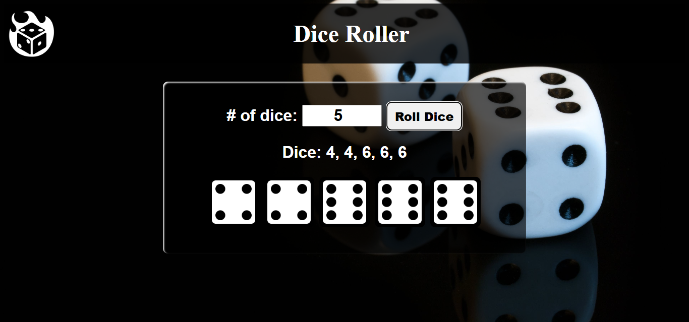

# 🎲 Dice Roller App

A simple and fun web application that simulates rolling multiple six-sided dice. Enter the number of dice, click **Roll Dice**, and see both the numerical results and dice-face images.

---

## 🔍 Project Description

The **Dice Roller** app lets users roll one or more dice at once. Built with HTML, CSS, and vanilla JavaScript, it's great for learning about DOM manipulation, random number generation, and responsive styling.

---

## ⚙️ Features

- Roll any number of six-sided dice
- View both numerical results and matching images
- Clean, responsive design with hover effects and a themed background

---

## 🛠️ Built With

- **HTML5** – Structure and layout  
- **CSS3** – Styling and visual effects  
- **JavaScript** – Dice roll logic and dynamic content

---

## 📸 Screenshots

  

---

